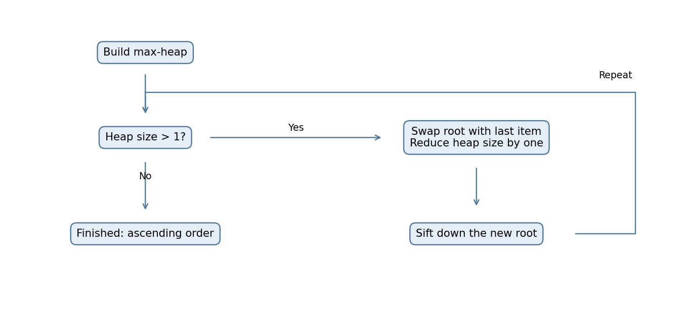
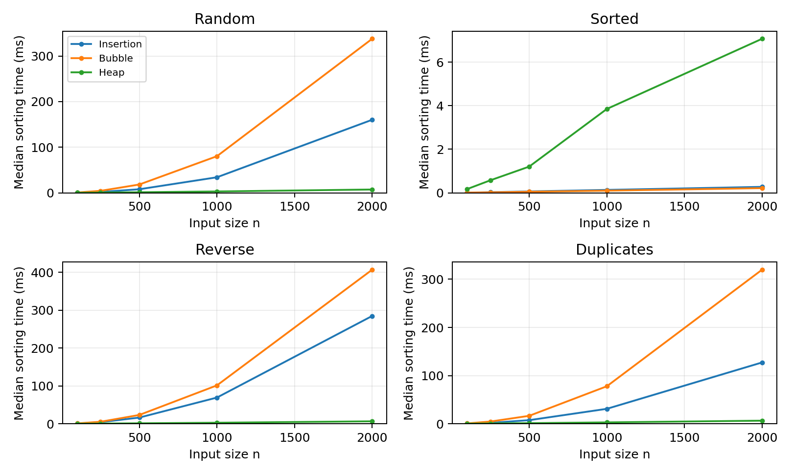
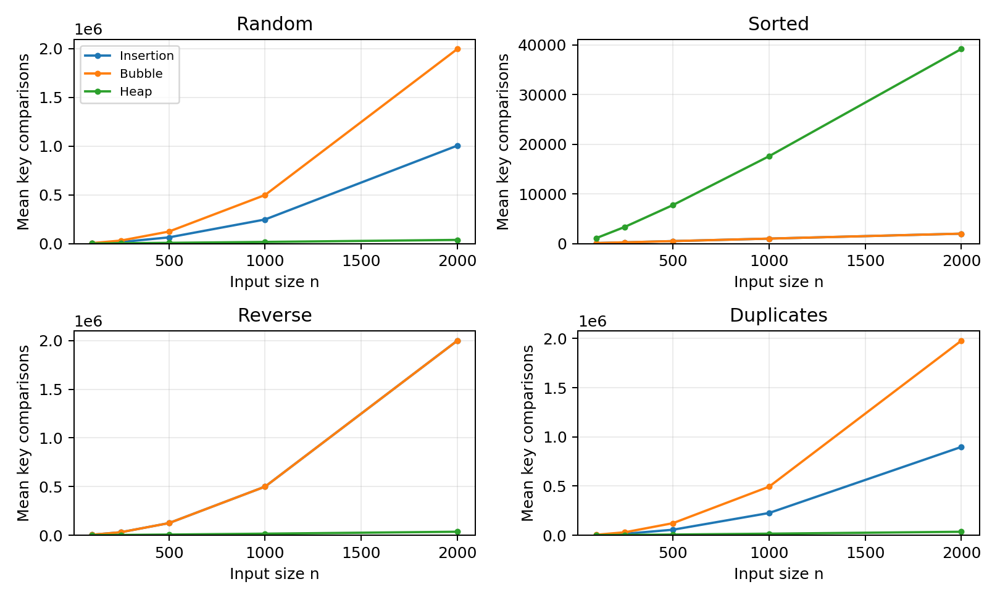
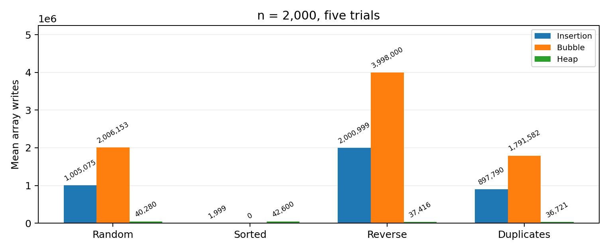

# Homework 1: Compare Sorting

Insertion Sort, Bubble Sort and Heap Sort

Student: LIU SIYU

Student ID: 2025193151

GitHub repository URL: https://github.com/LIUSIYU518/sorting-homework1

The student ID and repository URL can also be entered in the editable fields at the bottom of this page.

## 1. Code report

## 1.1 Choice of algorithms

For this assignment, I chose Insertion Sort and Bubble Sort from the algorithms covered in class, and Heap Sort as the new algorithm. The comparison uses the same input for all three. I wanted to compare their running times and see how the results change when the input is already sorted, reversed or contains many repeated values.

Heap Sort was chosen from the Wikipedia list because its worst-case time is O(n log n), while Insertion Sort and Bubble Sort can take O(n squared). This makes the difference easier to see as the input gets larger. The code sorts the items directly instead of calling Python sorted() or list.sort().

## 1.2 File structure and interface

| File | Purpose |
| --- | --- |
| sorting.py | Three sorting functions, sift_down and optional counters. |
| verify.py / demo.py | Correctness checks, stability test and small number example. |
| benchmark.py | Paired-input experiment; raw data, summaries and environment. |
| build_report.py | Charts and PDF generated from the saved results. |
| results/ | CSV data and JSON verification / environment records. |

The three sorting functions have the same inputs: a list, a key function and an optional counter. They change the original list and return no value. For normal numbers, the number itself is compared. For the stability test, only the first part of each (key, tag) pair is compared. Using the same interface makes the experiments easier to run.

## 1.3 Design choices and checks

The experiment calls all algorithms through the same ALGORITHMS dictionary. This keeps the input copying, timer and checking method the same. A key function makes it possible to sort both numbers and records. Passing stats=None turns off the counters during timing. The common helpers greater() and swap() keep the counting rules consistent.

Run python3 verify.py to check correctness and stability, and python3 demo.py to reproduce the small numerical example. Run python3 benchmark.py for the full experiment. The sorting and testing code needs only the Python standard library.

# 2. Algorithm report

## 2.1 Insertion Sort

Insertion Sort keeps the left part of the list sorted. It takes the next value, moves larger values to the right, and puts the saved value into the correct place. The sorted part grows by one item each time. Equal values are not moved past each other, so the algorithm is stable.

For example, [4, 2, 3] becomes [2, 4, 3] after inserting 2, and then [2, 3, 4] after inserting 3. If the list is already sorted, only n - 1 comparisons are needed. With distinct values in reverse order, the number is 1 + 2 + ... + (n - 1) = n(n - 1)/2. Its best time is O(n), and its average and worst time are O(n squared).

## 2.2 Bubble Sort

Bubble Sort compares two neighboring values and swaps them if the left one is larger. After one pass, the largest remaining value is at the end, so the next pass can be shorter. In this code, the loop stops early if a complete pass has no swaps.

For [4, 2, 3], the first pass changes the list to [2, 4, 3] and then [2, 3, 4]. The next pass has no swaps and stops. Because of this early-stop condition, sorted input takes O(n) time. Average and worst time are O(n squared). Equal neighboring values are not swapped, so their original order is kept.

## 2.3 Heap Sort: self-study algorithm

Heap Sort uses a max-heap. This means each parent is at least as large as its children, and the largest value is at the root. The tree is stored in the original list. If a node is at index i, its children are at 2i + 1 and 2i + 2.

There are two main steps. First, build the heap by calling sift_down from the last parent back to the root. Second, swap the root with the last item in the heap. That largest value is now in its final position. Reduce the heap size and use sift_down again to repair it. Repeating this puts all values in ascending order.

Building the heap from the bottom takes O(n) time because most nodes are near the leaves and need little work. Each later repair follows a path of at most O(log n) levels. There are n - 1 extractions, so the total worst-case time is O(n log n). This code uses loops instead of recursion and needs O(1) extra space. It is not stable because a swap can move one equal-key item past another.

| Algorithm | Best time | Average / worst | Extra space | Stable? |
| --- | --- | --- | --- | --- |
| Insertion | O(n) | O(n squared) | O(1) | Yes |
| Bubble* | O(n) | O(n squared) | O(1) | Yes |
| Heap | O(n log n)** | O(n log n) | O(1) | No |

* Bubble Sort includes early stopping. ** Heap best case shown for distinct keys; all equal keys take O(n) in this code. Average time assumes random ordering of distinct keys.

# 2.4 Numerical example and Heap Sort flow

The instructor uses the list [5, 1, 4, 2] to explain Bubble Sort. The same list is used here to show all three algorithms. These steps can be checked using demo.py. In the assignment trace, a swap appears as two writes, so an intermediate trace entry can temporarily contain a repeated value.

| Algorithm | Main states |
| --- | --- |
| Insertion | [5, 1, 4, 2] -> [1, 5, 4, 2] -> [1, 4, 5, 2] -> [1, 2, 4, 5] |
| Bubble | [5, 1, 4, 2] -> [1, 5, 4, 2] -> [1, 4, 5, 2] -> [1, 4, 2, 5] -> [1, 2, 4, 5] |
| Heap | Build: [5, 2, 4, 1]. After extracting and repairing: [4, 2, 1, 5] -> [2, 1, 4, 5] -> [1, 2, 4, 5]. |

| Algorithm | Key comparisons | Array writes |
| --- | --- | --- |
| Insertion | 6 | 7 |
| Bubble | 6 | 8 |
| Heap | 6 | 12 |

All three sorts use six key comparisons for this example, but the number of writes differs. Insertion shifts values, while Bubble and Heap exchange pairs. In this Python code, a swap counts as two array writes. The instructor counts three moves for a C swap, including the temporary-variable assignment. These are different counting rules, so the movement numbers should not be compared directly.

Before each extraction, the active part is a max-heap. The last part is already sorted. Moving the maximum to the last active position grows the sorted part by one item.

# 3. Algorithm experiments

## 3.1 Input data

Input sizes are 100, 250, 500, 1000, 2000. Each size and pattern has 5 trials. Base seed is 20260930. Every algorithm receives a fresh copy of the same array in a trial. Algorithm order is shuffled with a seeded generator. Random and duplicate-heavy arrays vary between trials; sorted and reverse arrays repeat the same deterministic input.

| Pattern | Construction |
| --- | --- |
| Random | Uniform integer draws from 0 through 10n - 1. |
| Sorted | Distinct integers 0 through n - 1 in ascending order. |
| Reverse | The same distinct integers in descending order. |
| Duplicates | Uniform integer draws from 0 through 9. |

## 3.2 Measurements

The program measures sorting time with perf_counter_ns. The report uses the median of five runs, in milliseconds. Creating and copying the input, checking the answer and saving files are not included in the time. Each algorithm has a small warm-up run first. Comparisons and writes are counted in separate runs, so the counters do not affect the reported time.

A comparison is one comparison between two keys, even when the condition is false. Loop and index checks are not counted. A write is one assignment to a list position, so a swap counts as two writes. Memory is checked separately with tracemalloc at the largest input size, once for each algorithm and input type. Tracing starts after the input copy is made, so the values show extra Python allocation during sorting, not the total memory of the program.

## 3.3 Correctness and stability

Validation uses 1,193 integer input cases, including every array of length 0 to 6 over [-1, 0, 1] and 100 seeded random arrays. Counted and uncounted versions are both checked, for 7,158 checks in total. Each result must exactly match Python sorted(source), checking both order and element preservation. Python sorted() is used only to check the results, not inside the three sorting functions.

For stability, use (key, tag) records and compare only the key. Input: (2,A), (1,B), (2,C), (1,D), (2,E). Insertion and Bubble output (1,B), (1,D), (2,A), (2,C), (2,E). Heap outputs (1,B), (1,D), (2,C), (2,E), (2,A), reversing the order of some equal-key records. Insertion and Bubble also pass tagged-record checks across all integer test cases.

## 3.4 Execution environment

Python 3.12.14; Linux-6.18.44-x86_64-with-glibc2.39. These results were generated in Codex's Linux environment with AI assistance, rather than on my own computer. Processor identifier: x86_64; detailed CPU model was not exposed. Results should be rerun locally when comparing absolute speed.

# 3.5 Results: running time

The experiment contains 300 timed runs. Every output matched the expected sorted list. The following graphs and table show the times recorded by the program.

## Timing at n = 2,000

| Input | Insertion (ms) | Bubble (ms) | Heap (ms) |
| --- | --- | --- | --- |
| Random | 160.188 | 337.723 | 7.274 |
| Sorted | 0.274 | 0.216 | 7.074 |
| Reverse | 284.659 | 406.835 | 6.392 |
| Duplicates | 127.260 | 319.889 | 6.382 |

At n = 2,000, Heap Sort is 22.0 times faster than Insertion Sort and 46.4 times faster than Bubble Sort on the random inputs in this run. The random and reverse curves show a much stronger size effect for the quadratic algorithms. Sorted input is different: Insertion and Bubble need only one linear scan, while Heap still reorganizes the distinct keys.

With many repeated values, the algorithms do not swap or shift equal values. This helps explain why the results differ from the random-input case. Here, the repeated values are limited to the integers 0 through 9.

# 3.6 Results: comparisons and writes

## Mean operations at n = 2,000

| Input | Algorithm | Key comparisons | Array writes |
| --- | --- | --- | --- |
| Random | Insertion | 1,005,069.6 | 1,005,075.4 |
| Random | Bubble | 1,996,691.4 | 2,006,152.8 |
| Random | Heap | 37,675.8 | 40,280.4 |
| Sorted | Insertion | 1,999.0 | 1,999.0 |
| Sorted | Bubble | 1,999.0 | 0.0 |
| Sorted | Heap | 39,159.0 | 42,600.0 |
| Reverse | Insertion | 1,999,000.0 | 2,000,999.0 |
| Reverse | Bubble | 1,999,000.0 | 3,998,000.0 |
| Reverse | Heap | 35,964.0 | 37,416.0 |
| Duplicates | Insertion | 897,787.8 | 897,789.8 |
| Duplicates | Bubble | 1,978,140.8 | 1,791,581.6 |
| Duplicates | Heap | 35,222.8 | 36,720.8 |

For distinct reverse input, n(n - 1)/2 = 1,999,000, matching the comparison counts of Insertion and Bubble. Bubble writes twice per swap; Insertion shifts and then places each saved item. This shows why two algorithms with similar comparison counts can still take different amounts of time.

# 3.7 What happens when n doubles?

The instructor compares increasing sizes to check how quickly the work grows. The table below uses our random-input results at n = 500, 1,000 and 2,000. Each entry is the mean comparison count over five trials. The ratio is the count divided by the count at the previous size.

| n | Insertion / ratio | Bubble / ratio | Heap / ratio |
| --- | --- | --- | --- |
| 500 | 63,712.0 / - | 123,456.2 / - | 7,407.0 / - |
| 1000 | 247,303.2 / 3.88x | 498,396.2 / 4.04x | 16,871.6 / 2.28x |
| 2000 | 1,005,069.6 / 4.06x | 1,996,691.4 / 4.01x | 37,675.8 / 2.23x |

For the two quadratic algorithms, doubling n makes the comparison count close to four times as large: (2n) squared = 4n squared. Heap Sort grows more slowly. For n log n, doubling n gives a ratio of 2 log(2n) / log(n), a little above two. Finite measurements support this pattern but do not prove the complexity bound.

## Array writes by input type

Bubble Sort makes many writes on reverse input because every comparison causes a swap. Insertion Sort shifts one value at a time and writes fewer array positions. On sorted input, Bubble makes no writes, but this Insertion implementation still places each saved value back into its position. That counts as n - 1 writes even when the list does not change.

## Recursion and counting conventions

These three implementations use loops, including sift_down. Their recursive depth is zero. Heap Sort calls a helper, but it does not call itself recursively. The experiment reports Python allocation separately rather than copying the C sample's eight-byte memory figure. The language, input generator and counting rules differ from the instructor's example.

# 3.8 Memory, discussion and AI learning

## Extra memory

| Input | Insertion peak (B) | Bubble peak (B) | Heap peak (B) |
| --- | --- | --- | --- |
| Random | 148 | 224 | 196 |
| Sorted | 148 | 192 | 196 |
| Reverse | 148 | 224 | 196 |
| Duplicates | 148 | 224 | 196 |

All three algorithms use only a few temporary variables and do not create another list inside the sort. Their extra space is O(1). The measured byte counts are slightly different because Python also allocates temporary objects. O(1) means the number of working variables stays constant; it does not mean that no extra memory is used.

## AI-assisted learning: Heap Sort

AI was used to explain Heap Sort and help prepare the code, experiments and report. The main learning points are listed below, as required for the algorithm not covered in class.

What is a heap? A max-heap is a complete binary tree stored in an array, with each parent at least as large as its children. It is not a fully sorted array. Only the largest key is guaranteed to be at the root.

How does it sort? Build the heap from the last internal node backward. Exchange the root with the last active element, reduce the active size, and repair the root by repeatedly exchanging it with its larger child. The sorted suffix grows by one position per extraction.

Why O(n log n)? The heap height is O(log n), so a repair is at most logarithmic. There are n - 1 extractions. Bottom-up construction is O(n), because most nodes are close to the leaves and require little repair work.

Why is it unstable? A root-to-end exchange can move an equal-key record past another one. The tagged-record test shows this behavior without comparing the tags. Iterative sift-down keeps auxiliary space constant.

## Conclusion and limits

The main result is that Heap Sort is faster for the larger random and reverse inputs in this experiment. However, when the input is already sorted, Insertion Sort and Bubble Sort are faster because they can finish with a simple scan. Insertion Sort and Bubble Sort also keep equal-key items in their original order, while Heap Sort does not. The choice therefore depends on both the input and whether stability is needed.

This comparison uses five trials and at most 2,000 values. The exact times can change on another computer, and larger inputs may give different speed ratios. The saved CSV files include the smallest and largest times as well as the medians.

## References

[1] Wikipedia, Sorting algorithm, comparison of algorithms: https://en.wikipedia.org/wiki/Sorting_algorithm#Comparison_of_algorithms
[2] Wikipedia, Heapsort: https://en.wikipedia.org/wiki/Heapsort
[3] Sedgewick and Wayne, Algorithms, 4th ed., companion section 2.4 (heap construction and sortdown): https://algs4.cs.princeton.edu/24pq/
Accessed 30 September 2026. Course material: Topic 03, Divide and Conquer and Merge Sort (pp. 2, 25 and 43); Homework 1 instructions and the instructor's sample report screenshots.
